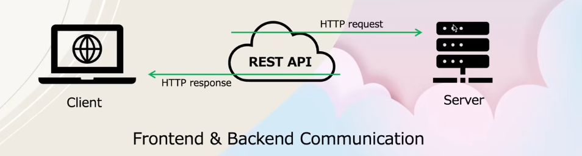

# Django REST Framework Guide

## Basic Understanding

| Term       | Also Called     | Where it Runs              | What it Does                                              | Technologies (Examples)                          |
|------------|-----------------|----------------------------|-----------------------------------------------------------|--------------------------------------------------|
| **Frontend** | Client-side    | User's browser / phone    | Everything you **see** and **interact** with             | HTML, CSS, JavaScript, React, Vue, Svelte, Tailwind |
| **Backend**  | Server-side    | Remote server / computer  | Logic, database, authentication, security, calculations  | Node.js, Express, Python, Django, Flask, PHP, Java (Spring) |

## What is an API?

It stands for "Application Programming Interface." It acts as a two-way communication bridge between frontend and backend.

**Example:** In a restaurant while ordering food, it involves three entities: You, Waiter, and Cook. You are the frontend, cook is the backend, and API is the waiter.



The client requests some data from the server through REST API using an HTTP Request. In response, the server sends the HTTP Response to the client through REST API.

## What is REST API?

It stands for "Representational State Transfer". It organizes how web applications talk to each other, separating what the user sees (frontend) from what runs behind the scenes (backend).

## Core Principles of REST API

**Stateless**
- The server doesn't store any information about the client between requests. It forgets the request immediately after it's done. For instance, the cook forgets your request after the waiter serves you.

**Client-Server Architecture**
- The app (client) asks for things (data) and the server does what is requested (sends data or makes changes).

**Standardized Interface**
- REST APIs rely on a set of standard methods (GET, POST, PUT, DELETE) for interacting with resources.

```
GET    - Retrieving the resource
POST   - Creating the resource
PUT    - Updating the resource
DELETE - Deleting the resource
```

**Easy-to-Read Data**
- REST APIs return responses in standardized easy-to-read formats, typically JSON or XML formats.

## RESTful Operations: URI vs URL

| HTTP Method | Operation              | URI                  | Full URL Example                                      | Description                                      |
|-------------|------------------------|----------------------|-------------------------------------------------------|--------------------------------------------------|
| **GET**     | Retrieve all           | `/students`          | `https://api.example.com/students`                    | Get the list of all students                     |
| **GET**     | Retrieve one           | `/students/2`        | `https://api.example.com/students/2`                  | Get details of student with ID 2                 |
| **POST**    | Create                 | `/students`          | `https://api.example.com/students`                    | Create a new student                             |
| **PUT**     | Update (Full)          | `/students/2`        | `https://api.example.com/students/2`                  | Update entire data of student with ID 2          |
| **PATCH**   | Update (Partial)       | `/students/2`        | `https://api.example.com/students/2`                  | Update specific fields of student with ID 2      |
| **DELETE**  | Delete                 | `/students/2`        | `https://api.example.com/students/2`                  | Delete student with ID 2                         |

### Key Points

URI is the superset (parent), URL is the subset (child).

- **URI** = The path that **identifies** the resource (e.g., `/students` or `/students/2`)
- **URL** = The complete address used by the client (frontend) to actually call the API (Protocol + Domain + URI)

In REST APIs, we usually design and talk about the **URI**, but when making actual requests from frontend or Postman, we use the **full URL**.

### Simple Analogy

- **URI**: The order number on the menu (`/students/2` or "Order #2")
- **URL**: The full address of the restaurant + the order (`https://api.example.com/students/2` or "Restaurant ABC, Kathmandu + Order #2")

## URL Endpoints

There are two types of URL endpoints:

### 1. Web Application Endpoints

Users can directly access it from web browsers.

```
http://127.0.0.1:8000/students/
```

### 2. API Endpoints

Returns data to integrate into the frontend. To access it programmatically from Postman or Thunderclient, we need to pass authentication tokens with it.

```
http://127.0.0.1:8000/api/v1/students/
```

## Manual Serialization

**Serialization**: Converting Django model data into a format like JSON so it can be sent to frontend or APIs.

**Manual serialization**: You convert model objects to JSON yourself, instead of using tools like Django REST Framework.

### Why Set `safe=False`?

In order to allow non-dict objects to be serialized, set the `safe` parameter to `False`.

**Example 1 - Error Case:**

```python
def studentsView(request):
    student = Student.objects.all()
    print(student)
    # <QuerySet [<Student: Rajesh Thapa>, <Student: Rohan Thapa>, <Student: Nabaraj Basnet>]>
    return JsonResponse(student)
```

Here, we were sending the queryset in `student` but `JsonResponse` expects it to be a dictionary, so we need to manually serialize the data to JSON format.

**Example 2 - Correct Approach:**

```python
def studentsView(request):
    student = Student.objects.all()
    students_list = list(student.values())
    return JsonResponse(students_list, safe=False)
```

Here, `safe=False` is used since we are passing a list instead of a dictionary.

### Important Note

The manual serialization technique is not recommended for creating APIs as we need a more powerful tool to serialize complex data, which can also handle validation for us. This is where serializers come in, which is provided by Django REST Framework.

## Serializers

Converting complex data (like Django models) into JSON or other specified format.

## Deserializers

Converting JSON back into Python objects (and saving to DB) mostly as QuerySet. 

One common serializers is **Model Serializers** as it automatically creates a translator based on the structure of our model. So, there is no need of manually defining how the data should be converted.

## Function-Based View 
A Function-Based View (FBV) is the simplest way to handle requests in frameworks like Django. It’s just a Python function that takes a request and returns a response. It is simply, a python function that receives a HTTP request and returns an HTTP response.

## How it works
- User sends request (browser / Postman)
- Django URL dispatcher maps URL → function
- Function executes logic
- Returns response

## Class-Based View
- Class-based views provide more structured and organized way to handle requests using object-oriented principles. 
- They take away conditional checks like if and elif used in function-based view and they instead use instance methods like get(), post(), put() and delete() and they will automatically be mapped to get the requests.
- Code reusability is the major feature i.e. the same CRUD operation will be done in few lines of code.

# 🔹 Mixins (Django REST Framework)

Mixins are **reusable code classes** in object-oriented programming that provide specific functionalities.

In Django REST Framework, mixins are used to add common functionality to views such as **Create, Read, Update, and Delete (CRUD)** operations.

### ListModelMixin

Used to **retrieve a list of objects** (multiple records).

```python
.list()
```

### CreateModelMixin

Used to create a new object in the database.

```python
.create()
```

### RetrieveModelMixin

Used to retrieve a single object based on ID.

```python
.retrieve()
```

### UpdateModelMixin

Used to update an existing object using primary key.

```python
.update()
.partial_update()
```

### DestroyModelMixin

Used to delete an object using primary key.

```python
.destroy()
```

### Implementation

For mixins, create a class-based view and inherit the required mixins. `GeneralAPIView` acts as a foundational class for building most API views.

It provides essential functionalities for handling incoming HTTP requests such as GET, POST, PUT, and DELETE. It also provides a proper HTML form for POST requests.

```python
class Employee(mixins.ListModelMixin, generics.GenericAPIView):
    def get(self, request):
        return self.list(request)
```

## Generics

Generics are class-based views in DRF that provide common CRUD functionality by combining `GenericAPIView` with mixins, reducing the need to write repetitive code.

**Available Views:**

- Single API views: `ListAPIView`, `CreateAPIView`, `RetrieveAPIView`, `UpdateAPIView`, `DestroyAPIView`
- Combination views: `ListCreateAPIView`, `RetrieveUpdateAPIView`, `RetrieveUpdateDestroyAPIView`

## ViewSets

As the name suggests, it is a set of views that combines the functionalities of both views and serializers, making it even easier to perform standard operations.

**Available ViewSets:**

- `viewsets.ViewSet`: Provides operations like `list()`, `create()`, `retrieve()`, `update()`, and `delete()`
- `viewsets.ModelViewSet`: Takes only `queryset` and `serializer_class` and automatically provides both pk-based and non-pk-based operations.

### Routers

ViewSets work through something called **Routers**. The Router class automatically determines the URL Patterns for us. All we need to do is register our view to the Router class—there is no need to create URL Patterns explicitly.

## Nested Serializers

Nested serializers are serializers used inside another serializer to represent related models (like ForeignKey, OneToOne, ManyToMany) in a structured, hierarchical JSON format.

### Why Use Nested Serializers

- Show related data together in one API response
- Avoid multiple API calls
- Provide clean, structured JSON

For example, in a `Blog` post with many comments, to retrieve all comments of that individual `Blog` post at once, we use `Nested Serializers`.

## Pagination (Django REST Framework)

Pagination is the process of **breaking large datasets into smaller, manageable chunks**. It improves **performance** and **user experience**.

DRF provides built-in pagination classes:

- `PageNumberPagination`
- `LimitOffsetPagination`
- `CursorPagination`

### PageNumberPagination

Uses page numbers to navigate.

```
/blogs/?page=2
```

You can control items per page using `page_size`.

**Example response:**

```json
{
  "count": 100,
  "next": "http://api.com/blogs/?page=3",
  "previous": "http://api.com/blogs/?page=1",
  "results": [ ... ]
}
```

### LimitOffsetPagination

Uses limit and offset parameters to navigate.

```
/blogs/?limit=10&offset=0
```

- `limit`: number of items per page
- `offset`: starting position

**Example:**
- `offset=0` → items 1–10
- `offset=10` → items 11–20

### CursorPagination

Uses a cursor (encoded value) instead of page numbers.

```
/blogs/?cursor=abc123
```

- More efficient for large datasets
- Prevents duplicate/skipped data when records change

## Ways to Implement Pagination

### 1. Global Pagination (applies to entire project)

Set it in `settings.py`:

```python
REST_FRAMEWORK = {
    'DEFAULT_PAGINATION_CLASS': 'rest_framework.pagination.PageNumberPagination',
    'PAGE_SIZE': 10
}
```

Automatically applied to:
- Generic views
- ViewSets

### 2. Local Pagination (per view)

Define a custom pagination class:

```python
from rest_framework.pagination import PageNumberPagination

class MyPagination(PageNumberPagination):
    page_size = 5
    page_size_query_param = 'page_size'
    max_page_size = 50
```

Apply it to a specific view:

```python
from rest_framework.generics import ListAPIView

class BlogListView(ListAPIView):
    queryset = Blog.objects.all()
    serializer_class = BlogSerializer
    pagination_class = MyPagination
```

Only affects this view and overrides global settings.

### Key Differences

| Feature     | Global Pagination | Local Pagination |
|-------------|-------------------|------------------|
| Scope       | Entire project    | Specific view    |
| Setup       | settings.py       | Inside view      |
| Flexibility | Less              | More             |

## Filtering
- It is used to filter down the data. 
- Use the library called`django_filters`.
- Similar to `pagination`, filter can be set to global filter and per-view filter.
- Global filters doesn't handle case-based mismatch so we use custom filters instead
- Custom filters attribute:
`iexact`: for case-insesitive matches